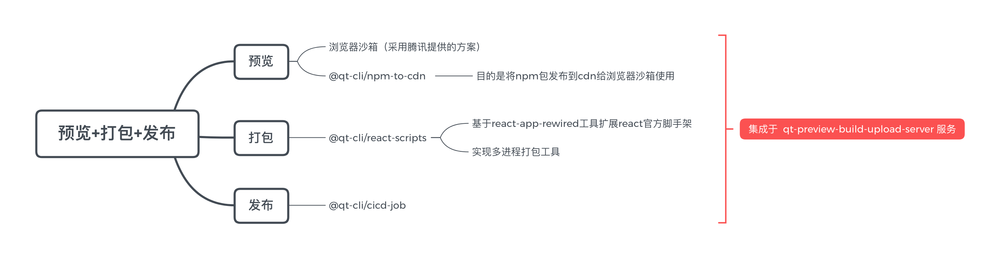

## 简介

> 根据一段 React 代码，可以实现预览，打包、发布功能 - 学习笔记。

## 架构图

## 预览

- [从 0 到 1 实现浏览器端沙盒运行环境](https://cloud.tencent.com/developer/article/1838226)

## 打包

- [create-react-app](https://github.com/facebook/create-react-app)
- [react-app-rewired](https://github.com/timarney/react-app-rewired/blob/master/README_zh.md)
- [customize-cra](https://github.com/arackaf/customize-cra)
- [create-react-app 优雅定制指南](https://segmentfault.com/a/1190000021232993)

## 发布

- [upyun](https://github.com/upyun/node-sdk)
- [ali-oss](https://github.com/ali-sdk/ali-oss)
