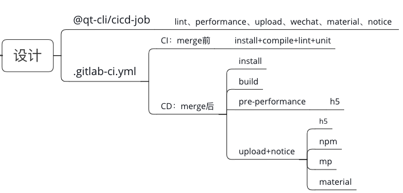

## 简介

> 前端 CI/CD 学习笔记。

## 学习路线

- Docker
- Gitlab
- 单仓库: Monorepo
- 单一工作流工具: @qt-cli/cicd-job
- 编排单一工作流: .gitlab.yml

## 整体设计

## pipeline效果

#### 1、合并到staging分支，点击 merge 前后

#### 2、合并到master分支，点击 merge 前后

