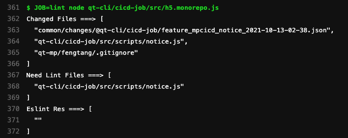
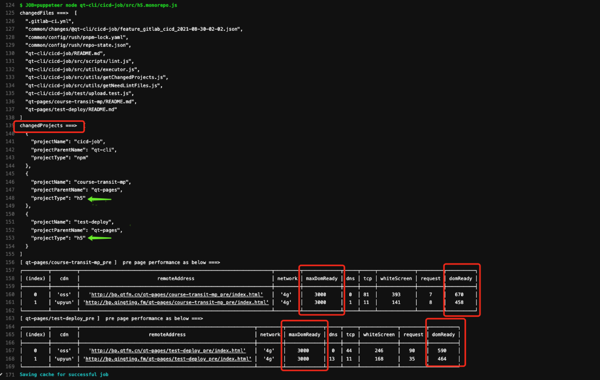
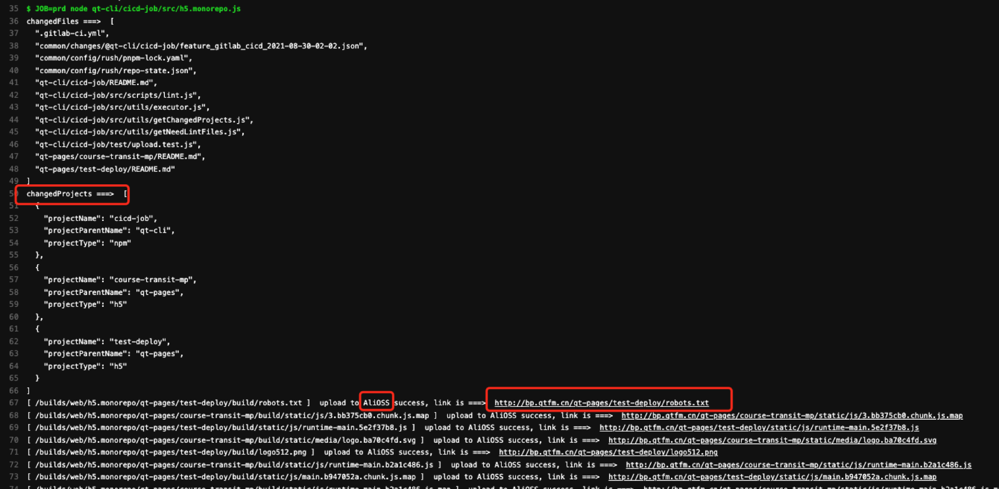
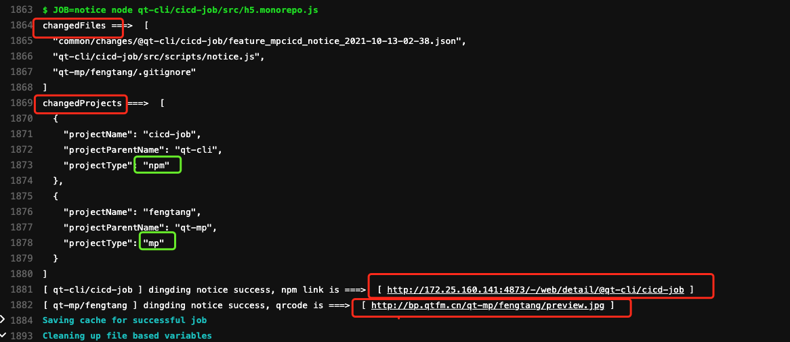
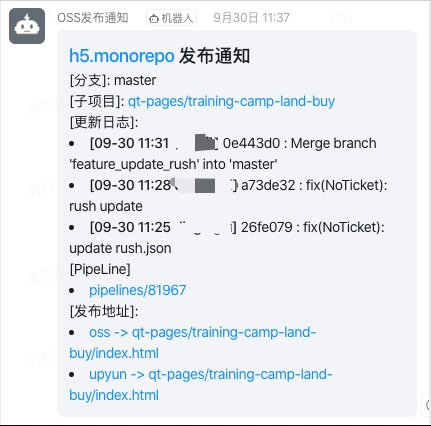
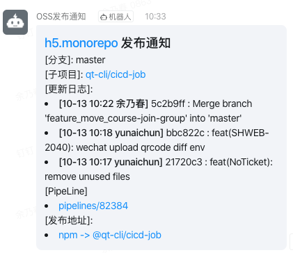
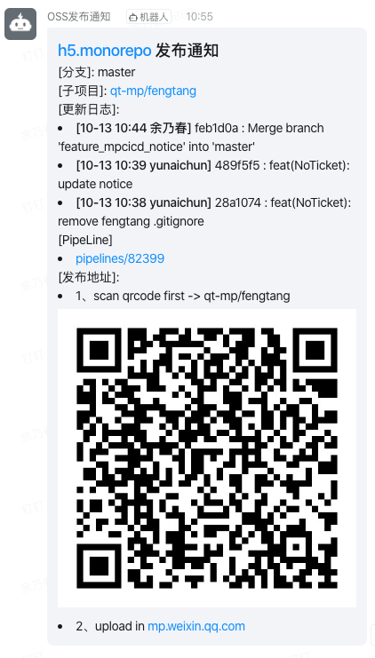
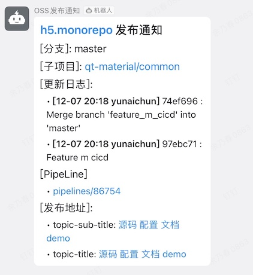

## 简介

- @qt-cli/cicd-job 目的是完成 Gitlab monorepo 中 h5、npm、mp、material 项目类型的发布等，单一 job 流工具

## lint

#### 执行时机

- mr到staging和master分支，点击merge前

#### log输出

- 显示改变的文件
- 显示需要lint的文件
- 执行lint后的结果

#### 效果图

## performance

#### 执行时机

- mr到master分支，点击merge后。会对 H5 项目会做性能检测

#### log输出

- 显示改变的文件
- 显示改变的项目
- 显示 H5 项目在 4g 网络下面的性能（我们对 H5 最大 domReady 最大时间做了设置为 3000 ms）

#### 效果图

## upload

#### 执行时机

- h5 项目: mr 到 staging 和 master 分支，点击 merge 后
- npm 包和微信小程序: mr 到 master 分支，点击 merge 后

#### log输出

- 显示改变的文件
- 显示改变的项目
- 执行upload后的结果

#### 效果图 - H5项目

- 此处会先上传 static 文件，最后上传 html 文件；
- 每次上传均会检测是否上传成功，如果不成功，会重试5次；
- 超过5次，中断后续上传

#### 效果图 - npm包和微信小程序

- npm 项目会输出 npm 包地址
- 微信小程序会输出小程序预览二维码

## notice

#### 执行时机

- mr 到 master 分支，点击 merge 后

#### 通知内容

- 项目地址、子项目地址、分支名称、最近3条commit时间及提交人、当前pipeline、发布地址、二维码地址

#### H5 效果图

#### NPM 效果图

#### 微信小程序效果图

#### 物料效果图

