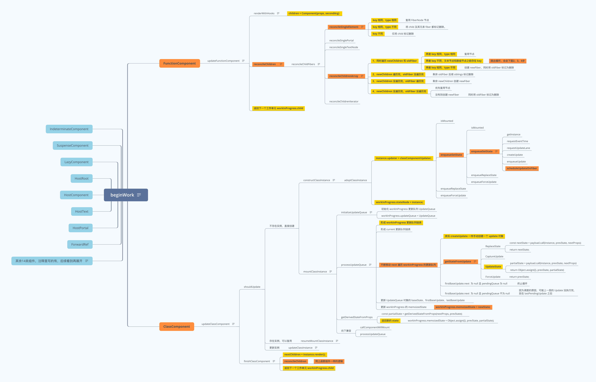

## 简介

> React - beginWork 源码阅读学习笔记。

## beginWork 流程

- 图片地址: https://www.answera.top/frontend/react/source-code/beginWork/beginWork.png
- 源文件地址: https://www.answera.top/frontend/react/source-code/beginWork/beginWork.xmind



## 遍历逻辑

```
1、beginWork 主要作用是 reconcile 协调处理所有子节点；
传入当前工作单元 workInProgress 和 current；
返回下一个工作单元，即 workInProgress 第一个子节点 workInProgress.child。

2、beginWork 内部遍历顺序：
通过 current.child.sibling 依次处理了所有的子节点；
同时使每个子节点的 return 属性均指向父节点 current。

3、由此可以看到：
beginWork 是顶部向下一层一层处理，即为自上而下的广度优先。
```

## 单节点diff

```
位置: react-reconciler/src/ReactChildFiber.old.js
方法: reconcileSingleElement 

1、key 相同，type 相同：复用 FiberNode 节点

2、key 相同，type 不同：将 child 及其兄弟 fiber 都标记删除。

3、key 不同：仅将 child 标记删除
```

## 节点 effect 链表

```
位置: react-reconciler/src/ReactChildFiber.old.js
方法: deleteChild 

1、parent 添加第一个删除节点 childToDelete

parent.firstEffect = child = parent.lastEffect


2、parent 添加第二个删除节点 childToDelete

                    nextEffect 
parent.firstEffect -----------> parent.lastEffect = child


3、parent 添加第三个删除节点 childToDelete

                     nextEffect        nextEffect
parent.firstEffect -----------> child -----------> parent.lastEffect = child
```

## 多节点diff

```
位置: react-reconciler/src/ReactChildFiber.old.js
方法: reconcileChildrenArray 


1、同时遍历 newChildren 和 oldFiber
两者 key 相同 -> 复用节点；
两者 key 不同 -> 跳出循环；
两者 key 相同，复用节点但无 alternate 属性 -> 标记删除。

2、newChildren 遍历完，oldFiber 没遍历完
将 oldFiber 后续 siblings 标记删除

3、newChildren 没遍历完，oldFiber 遍历完
将剩余 newChildren 标记新增

4、newChildren 没遍历完，oldFiber 没遍历完
优先复用；
没有则创建；
复用节点但无 alternate 属性，标记删除。
```

## 源码阅读

> 地址: https://github.com/yunaichun/react-study

## 参考资料

- [React官方文档](https://reactjs.org)
- [React源码](https://github.com/facebook/react/tree/8b2d3783e58d1acea53428a10d2035a8399060fe)
- [凹凸实验室](https://aotu.io/notes/2020/11/12/react-indoor/index.html)
- [阿里知乎专栏](https://zhuanlan.zhihu.com/purerender)
- [React源码解析](https://react.jokcy.me/)
- [React技术揭秘](https://react.iamkasong.com/)
- [React内部原理](http://tcatche.site/2017/07/react-internals-part-one-basic-rendering/)
