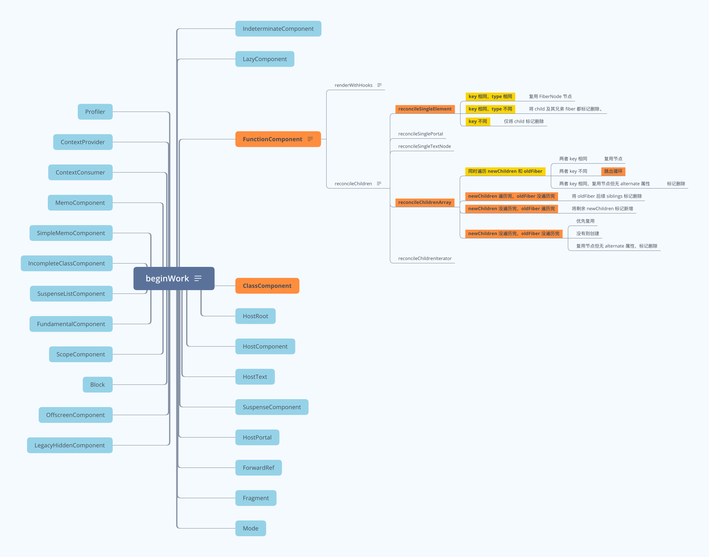

## 简介

> React - Class Component 源码阅读学习笔记。

## beginWork 整体流程

- 图片地址: https://www.answera.top/frontend/react/source-code/beginWork/beginWork.png
- 源文件地址: https://www.answera.top/frontend/react/source-code/beginWork/beginWork.xmind



## reconcileChildren 前处理

#### updateFunctionComponent 流程分析

```
由流程图可知 updateFunctionComponent 会经历流程:

1、constructClassInstance

2、mountClassInstance
initializeUpdateQueue -> processUpdateQueue -> getDerivedStateFromProps

3、finishClassComponent

下面按照顺序依次看下上面函数做了哪些事情。
```

#### 1、constructClassInstance 流程分析

**实际调用 adoptClassInstance**

```
instance.updater = classComponentUpdater;

workInProgress.stateNode = instance;
```

**classComponentUpdater 对象**

```
1、isMounted
2、enqueueReplaceState
3、enqueueForceUpdate
4、enqueueSetState，这个函数即为 setState 函数的实现
```

**enqueueSetState 流程**

```
1、getInstance
2、requestEventTime
3、requestUpdateLane
4、createUpdate
5、enqueueUpdate
6、scheduleUpdateOnFiber ，与 updateContainer 流程是一样的
```

#### 2、initializeUpdateQueue 流程分析

**创建 updateQueue 结构**

```js
1、baseState: fiber.memoizedState
本次更新前该 Fiber 节点的 state，Update 基于该 state 计算更新后的 state

2、firstBaseUpdate 和lastBaseUpdate
本次更新前该 Fiber 节点已保存的 Update
以链表形式存在，链表头为 firstBaseUpdate 
链表尾为 lastBaseUpdate

3、shared.pending
触发更新时，产生的 Update 会保存在 shared.pending 中形成单向环状链表
当由 Update 计算 state 时这个环会被剪开并连接在 lastBaseUpdate 后面

4、effects
数组。保存 update.calback !== null 的 Update
```

**赋值给 Fiber 节点**

```
fiber.updateQueue = queue;
```

#### 3、processUpdateQueue 流程分析

**首先处理 workInProgress、current 更新链表**

```
1、lastBaseUpdate 为 null
firstBaseUpdate = workInProgress.updateQueue.shared.pending

2、lastBaseUpdate 不为 null
                    next 
firstBaseUpdate -----------> workInProgress.updateQueue.shared.pending = lastPendingUpdate

3、假如再加入一个新的 Update
                    next                  next
firstBaseUpdate -----------> 上次 Update -----------> workInProgress.updateQueue.shared.pending = lastPendingUpdate
```

**通过不断移动 next 遍历 workInProgress 的更新队列**

```
1、类似 createUpdate 一样手动创建一个 update 对象

2、内部根据 getStateFromUpdate 通过 update.payload 获取最新的 state

3、firstBaseUpdate.next 为 null 且 pendingQueue 为 null 终止循环
因为调度的原因，可能上一层的 Update 没执行完，放在 UpdateQueue 的 lastPendingUpdate 之后
```

**更新 UpdateQueue 对象的 baseState、firstBaseUpdate、lastBaseUpdate**

```
queue.baseState = newState;
queue.firstBaseUpdate = newFirstBaseUpdate;
queue.lastBaseUpdate = newLastBaseUpdate;
```

**更新 workInProgress 的 memoizedState**

```
workInProgress.memoizedState = newState;
```

#### 4、getStateFromUpdate 流程分析

**参数**

```
1、workInProgress: 新 Fiber
2、queue: workInProgress 更新队列
3、update: 类似 createUpdate 一样手动创建一个 update 对象
4、prevState: UpdateQueue.baseState
5、nextProps: new props
6、instance: class 组件实例
```

**流程**

```
1、CaptureUpdate


2、ForceUpdate
return prevState;


3、ReplaceState
const nextState = payload.call(instance, prevState, nextProps);
return nextState


4、UpdateState: 这里即为 setState 计算结果

4.1 如果 payload 为对象
return Object.assign({}, prevState, payload);

4.2 如果 payload 为函数
const nextState = payload.call(instance, prevState, nextProps);
return Object.assign({}, prevState, partialState)
```

#### 5、getDerivedStateFromProps 流程分析

```js
const partialState = getDerivedStateFromProps(nextProps, prevState);

// == 返回新的 state
workInProgress.memoizedState = Object.assign({}, prevState, partialState);
```

#### 6、finishClassComponent 流程分析

```
1、执行实例的 render 方法返回 class 组件的 children
nextChildren = instance.render();

2、reconcileChildren(current, workInProgress, nextChildren, renderLanes);
通过 current.sibling 处理所有子节点

3、返回下一个工作单元 workInProgress.child
```

#### 7、reconcileChildren 流程分析

参考这里: https://www.answera.top/frontend/react/source-code/beginWork

## setState 相关问题及分析

#### 生命周期和合成事件 setState 是异步

```js
componentDidMount() { 
    console.log('初始 state: ', this.state.count); // 初始 state: 0 
    this.setState({ count: this.state.count + 1 }); 
    console.log('第一次 setState 之后: ', this.state.count); // 第一次 setState 之后: 0 
    this.setState({ count: this.state.count + 1 }); 
    console.log('第二次 setState 之后: ', this.state.count); // 第二次 setState 之后: 0 
}
```

#### 连续多次执行 setState 只会更新最后一次

```js
componentDidMount() { 
    console.log('初始 state: ', this.state.count); // 初始 state:  0 
    this.setState({ count: this.state.count + 1 }, () => {
        console.log('第一次 setState 之后: ', this.state.count); // 第一次 setState 之后: 1 
    }); 
    this.setState({ count: this.state.count + 1 }, () => {
        console.log('第二次 setState 之后: ', this.state.count); // 第二次 setState 之后: 1
    }); 
}
```

#### setState 第一个参数是函数每次都会更新

```js
componentDidMount() { 
    console.log('初始 state: ', this.state.count); // 初始 state:  0 
    this.setState((state, props) => {
        return {count: state.count + 1};
    }, () => {
        console.log('第一次 setState 之后: ', this.state.count); // 第一次 setState 之后: 1 
    }); 
    this.setState((state, props) => {
        return {count: state.count + 1};
    }, () => {
        console.log('第二次 setState 之后: ', this.state.count); // 第二次 setState 之后: 2
    }); 
}
```

#### 异步代码和原生事件 setState 是同步

```js
componentDidMount() { 
    setTimeout(() => { 
        console.log('初始 state: ', this.state.count); // 初始 state: 0 
        this.setState({ count: this.state.count + 1 }); 
        console.log('第一次 setState 之后: ', this.state.count); // 第一次 setState 之后: 1 
        this.setState({ count: this.state.count + 1 }); 
        console.log('第二次 setState 之后: ', this.state.count); // 第二次 setState 之后: 2 
    }, 0); 
}
```

#### setState 流程分析

```
1、setState 会调用 enqueueSetState 函数，引发一次重新渲染。

2、由于重新渲染不再走 componentDidMount 函数，所以猜测

2、重新渲染会经历的重要过程
enqueueUpdate: 处理多次 setState 调用，形成更新队列的链表
processUpdateQueue: 内部会循环更新队列的链表，每次循环都会调用 getStateFromUpdate 获取新的 state

3、getStateFromUpdate 获取新的 state 

4、执行 finishClassComponent 阶段，主要通过 instance.render() 得到 class 组件的实际节点

5、进入 reconcileChildren 阶段

6、由第 4 步骤可知，直到 render 函数被调用的时候，this.state 才会拿到最新计算出来值
```

#### 原因分析

```
1、多次调用 setState 是如何将更新队列连接起来的？

多次调用 setState 会通过 enqueueSetState 方法形成更新队列的链表；

在 processUpdateQueue 函数中通过 getStateFromUpdate 函数循环合并。

但是连续调用 2 次的话，为什么不会执行 2 次渲染，我在源码中还没有找到这部分的逻辑，待补充。
```

```
2、多次调用 setState 状态是如何合并的？

如果 payload 是对象的话，合并一定是保留最后一个的结果。

如果 payload 是函数的话，每个函数计算后都会得到一个新的 state 作为下一个 prevState 传入，所以不会被覆盖掉。

如果一开始 setState 的 payload 为函数，只要遇到 payload 为对象的话，之前 payload 为函数所做的合并都无效了。
```

```
3、为什么异步或原生事件会同步拿到结果？

直到 render 函数被调用的时候，this.state 才会拿到最新计算出来值。由此可知并实践得知:

如果是生命周期或者合成事件，会先输出 this.state；然后执行 render；所以拿到的是旧的 state。
如果是异步代码或者原生事件: 会先执行 render；然后输出 this.state；所以拿到的是新的 state。

但是我在源码中还没有找到这部分的逻辑，待补充。
```

## 生命周期介绍

#### 挂载阶段

```
1、constructor
必须在构造函数第一行执行 super(props)，否则我们无法在构造函数里拿到 this 对象

2、static getDerivedStateFromProps(nextProps, prevState) 取代 componentWillMount
一个静态方法，所以不能在这个函数里面使用 this

3、render
原生的 DOM，如 div、React 组件、Fragment（片段）、Portals（插槽）
字符串和数字，被渲染成 text 节点
Boolean 和 null，不会渲染任何东西

4、componentDidMount
```

#### 更新阶段

**触发更新操作**

```
1、HostRoot: ReactDOM.render

2、ClassComponent: this.setState、this.forceUpdate、props 改变

3、FunctionComponent: useState、useReducer
```

**经历过程**

```
1、static getDerivedStateFromProps(nextProps, prevState) 取代 componentWillReceiveProps
返回一个对象用来更新当前的 state 对象，如果不需要更新返回 null

2、shouldComponentUpdate(nextProps, nextState) ，默认返回 true
对比 state 和 props 决定是否渲染，来减少重新渲染，官方提倡使用 PureComponent 替代 shouldComponentUpdate

3、render

4、getSnapshotBeforeUpdate(prevProps, prevState) 取代 componentWillUpdate
返回值会作为第三个参数传给 componentDidUpdate，如果不需要返回值返回 null，不写的话控制台会有警告
一定要和 componentDidUpdate 一起使用，否则控制台也会有警告

5、componentDidUpdate(prevProps, prevState, snapshot)
```

#### 卸载阶段

```
componentWillUnmount

可以在这个函数里去清除一些定时器，取消绑定的事件等操作
```

#### 错误边界

```
static getDerivedStateFromError()

componentDidCatch()
```

## 源码阅读

> 地址: https://github.com/yunaichun/react-study

## 参考资料

- [React官方文档](https://reactjs.org)
- [React源码](https://github.com/facebook/react/tree/8b2d3783e58d1acea53428a10d2035a8399060fe)
- [凹凸实验室](https://aotu.io/notes/2020/11/12/react-indoor/index.html)
- [阿里知乎专栏](https://zhuanlan.zhihu.com/purerender)
- [React源码解析](https://react.jokcy.me/)
- [React技术揭秘](https://react.iamkasong.com/)
- [React内部原理](http://tcatche.site/2017/07/react-internals-part-one-basic-rendering/)
- [我对 React v16.4 生命周期的理解](https://juejin.cn/post/6844903655372488712)
- [React 原理之 setState 执行机制](https://www.studyfe.cn/2019/10/09/react/library-react-state/#toc-heading-7)
- [你真的理解 setState 吗？](https://juejin.cn/post/6844903636749778958#heading-5)
