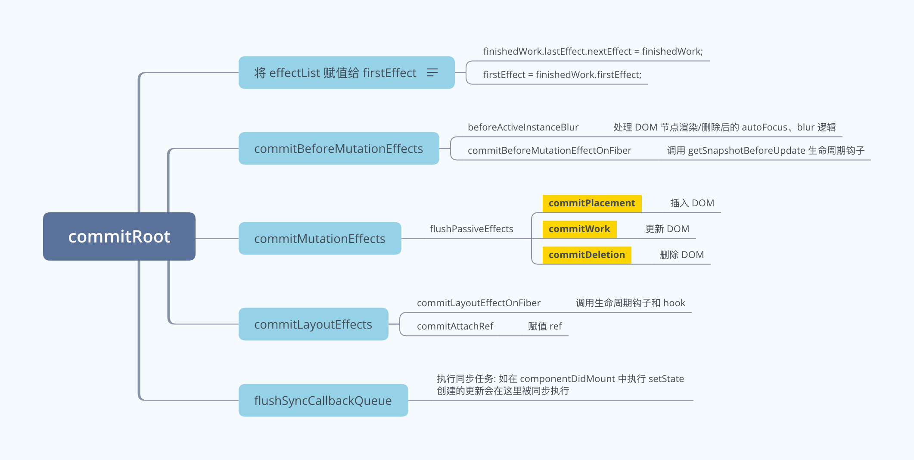

## 简介

> React - commitRoot 源码阅读学习笔记。

## commitRoot 流程

- 图片地址: https://www.answera.top/frontend/react/source-code/commitRoot/commitRoot.png
- 源文件地址: https://www.answera.top/frontend/react/source-code/commitRoot/commitRoot.xmind

## 源码阅读

> 地址: https://github.com/yunaichun/react-study

## 参考资料

- [React官方文档](https://reactjs.org)
- [React源码](https://github.com/facebook/react/tree/8b2d3783e58d1acea53428a10d2035a8399060fe)
- [凹凸实验室](https://aotu.io/notes/2020/11/12/react-indoor/index.html)
- [阿里知乎专栏](https://zhuanlan.zhihu.com/purerender)
- [React源码解析](https://react.jokcy.me/)
- [React技术揭秘](https://react.iamkasong.com/)
- [React内部原理](http://tcatche.site/2017/07/react-internals-part-one-basic-rendering/)
