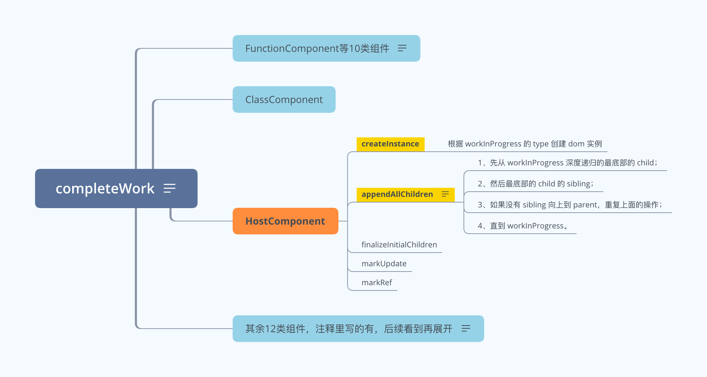

## 简介

> React - completeUnitOfWork 源码阅读学习笔记。

## completeUnitOfWork 流程

```
1、completeUnitOfWork 主要作用是所有节点均会执行 completeWork 逻辑；
执行时机是 completeWork 执行结果为 null，即 nextUnitOfWork 为 null。

2、completeUnitOfWork 内部遍历的顺序是：
从最底部的第一个节点开始；每个工作节点都会执行 completeWork 方法；
下一个工作节点是 siblings；如果没有 siblings，下一个工作节点是 parent。

3、由此可以看到：
completeUnitOfWork 是从底部向上一层一层处理，即为自下而上的广度优先。
```

## completeWork 流程

#### 整体流程

- 图片地址: https://www.answera.top/frontend/react/source-code/completeWork/completeWork.png
- 源文件地址: https://www.answera.top/frontend/react/source-code/completeWork/completeWork.xmind



#### 遍历逻辑

```
1、completeWork 的作用主要是为 workInProgress 创建 dom 实例；
然后将所有子节点添加到 workInProgress 的 instance 上。

2、completeWork 内部遍历的顺序是：
先从 workInProgress 深度递归的最底部的 child；
然后最底部的 child 的 sibling；
如果没有 sibling 向上到 parent，重复上面的操作；
直到 workInProgress。

3、由此可以看到：
completeWork 是从当前节点先深度优先递归到最底层，然后广度优先遍历完当前层，再回到上一层。
```

## 源码阅读

> 地址: https://github.com/yunaichun/react-study

## 参考资料

- [React官方文档](https://reactjs.org)
- [React源码](https://github.com/facebook/react/tree/8b2d3783e58d1acea53428a10d2035a8399060fe)
- [凹凸实验室](https://aotu.io/notes/2020/11/12/react-indoor/index.html)
- [阿里知乎专栏](https://zhuanlan.zhihu.com/purerender)
- [React源码解析](https://react.jokcy.me/)
- [React技术揭秘](https://react.iamkasong.com/)
- [React内部原理](http://tcatche.site/2017/07/react-internals-part-one-basic-rendering/)
