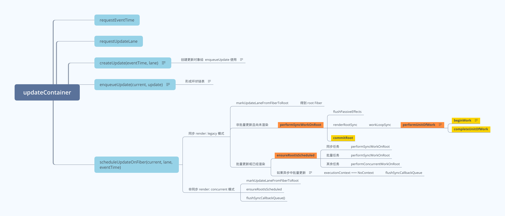

## 简介

> React - updateContainer 源码阅读学习笔记。

## updateContainer 流程

- 图片地址: https://www.answera.top/frontend/react/source-code/updateContainer/updateContainer.png
- 源文件地址: https://www.answera.top/frontend/react/source-code/updateContainer/updateContainer.xmind



## createUpdate 创建 update 更新对象

```js
// == 根据 eventTime, lane 创建更新对象
const update = {
  // == 任务时间，通过 performance.now() 获取的毫秒数
  eventTime,
  // == 优先级相关字段
  lane,

  // == 更新的类型，包括 UpdateState | ReplaceState | ForceUpdate | CaptureUpdate
  tag: UpdateState,
  // == 更新挂载的数据。不同类型组件挂载的数据不同：
  // == 对于 ClassComponent，payload 为 this.setState 的第一个传参。
  // == 对于 HostRoot，payload 为 ReactDOM.render 的第一个传参。
  payload: null,
  // == 更新的回调函数。不同类型组件挂载的数据不同：
  // == 对于 ClassComponent，callback 为 this.setState 的第二个传参。
  // == 对于 HostRoot，callback 为 ReactDOM.render 的第三个传参。
  callback: null,

  // == 与其他Update连接形成链表。挂载 fiber.updateQueue.shared.pending.next
  next: null,
};
```

## enqueueUpdate 形成更新链表

```
          next                                      next
update --------> fiber.updateQueue.shared.pending --------->  update
```

## scheduleUpdateOnFiber 调度 Fiber 节点的挂载

```js
// == 同步 render: legacy 模式，通过  ReactDOM.render 创建的 dom
if (lane === SyncLane) {
  // == 非批量更新且尚未渲染
  if (
    (executionContext & LegacyUnbatchedContext) !== NoContext &&
    (executionContext & (RenderContext | CommitContext)) === NoContext
  ) {
    schedulePendingInteractions(root, lane);
    performSyncWorkOnRoot(root);
  }
  // == 批量更新或已经渲染
  else {
    // == 调度更新
    ensureRootIsScheduled(root, eventTime);
    schedulePendingInteractions(root, lane);

    if (executionContext === NoContext) {
      resetRenderTimer();
      flushSyncCallbackQueue();
    }
  }
}
// == 非同步 render: concurrent 模式，通过  ReactDOM.createRoot 创建的 dom
else {
  // == ... 省略

  // == 调度更新
  ensureRootIsScheduled(root, eventTime);
  schedulePendingInteractions(root, lane);
}
```

## react 渲染模式

```
react 模式: https://zh-hans.reactjs.org/docs/concurrent-mode-adoption.html#why-so-many-modes

1、legacy 模式: ReactDOM.render(<App />, rootNode)。

2、blocking 模式: ReactDOM.createBlockingRoot(rootNode).render(<App />)。

3、concurrent 模式: ReactDOM.createRoot(rootNode).render(<App />)。创建的更新具有不同的优先级，同时也是可以打断的
```

## 渲染逻辑

```
一、legacy 模式
1、非批量更新且尚未渲染: performSyncWorkOnRoot(root);

2、批量更新或已经渲染: ensureRootIsScheduled(root, eventTime); 本质也是调用 performSyncWorkOnRoot(root);
不过当 executionContext === NoContext 时，会执行 flushSyncCallbackQueue();
(setTimeout 中执行 setState, 导致 batchedUpdates 中 executionContext 为 null)

二、concurrent 模式
ensureRootIsScheduled(root, eventTime);
```

## 源码阅读

> 地址: https://github.com/yunaichun/react-study

## 参考资料

- [React官方文档](https://reactjs.org)
- [React源码](https://github.com/facebook/react/tree/8b2d3783e58d1acea53428a10d2035a8399060fe)
- [凹凸实验室](https://aotu.io/notes/2020/11/12/react-indoor/index.html)
- [阿里知乎专栏](https://zhuanlan.zhihu.com/purerender)
- [React源码解析](https://react.jokcy.me/)
- [React技术揭秘](https://react.iamkasong.com/)
- [React内部原理](http://tcatche.site/2017/07/react-internals-part-one-basic-rendering/)
