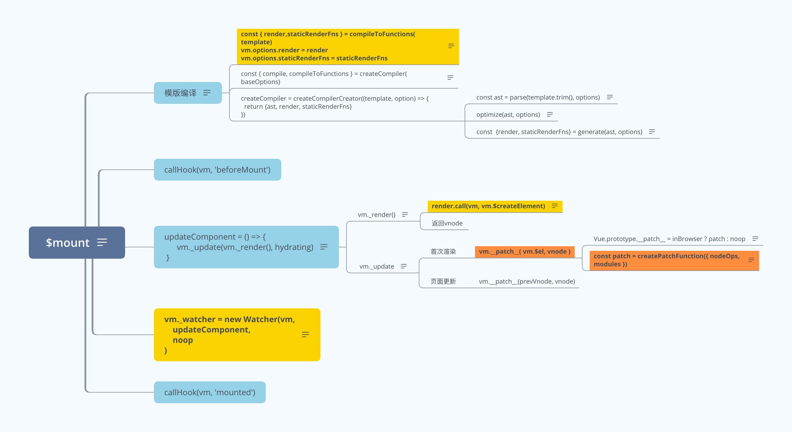

 ## 简介

> Vue 源码阅读渲染流程学习笔记。

## Vue 渲染流程图

- 流程图图片地址: https://www.answera.top/frontend/vue/vue/mount/mount.png
- 流程图 XMind 地址: https://www.answera.top/frontend/vue/vue/mount/mount.xmind

## 源码阅读

> 地址: https://github.com/yunaichun/vue-study

## 参考资料

- [Vue官方文档](https://cn.vuejs.org)
- [Vue2.1.7源码学习](http://hcysun.me/2017/03/03/Vue源码学习/)
- [人人都能懂的Vue源码系列](https://www.imooc.com/u/6702342/articles)
- [Vue.js技术揭秘](https://ustbhuangyi.github.io/vue-analysis/)
- [剖析 Vue.js 内部运行机制](https://github.com/answershuto/learnVue)
- [Vue.js 源码学习笔记](http://jiongks.name/blog/vue-code-review/)

