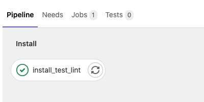

## 简介

> 前端 CI/CD 学习笔记。

## 学习路径

- Docker
- Gitlab
- Monorepo
- 单一工作流工具: @qt-cli/cicd-job
- 编排单一工作流: .gitlab.yml

## 整体设计

## pipeline效果

#### 1、合并到staging分支，点击 merge 前后

#### 2、合并到master分支，点击 merge 前后

## 参考资料

#### GitLab CI/CD 相关

- [GitLab 官方文档](https://docs.gitlab.com/runner/register/)
- [GitLab CI/CD 系列教程](https://www.bilibili.com/video/BV1iv41177zU/)
- [CSDN 系列博客](https://blog.csdn.net/github_35631540)

#### Jenkins CI/CD 相关

- [从 0 到 1 实现一套 CI/CD 流程](https://juejin.cn/book/6897616008173846543/section/6897634827311251471)
- [CI 持续集成和 CD 持续交付](http://www.pickstyle.cn/CI&CD/1.html)

#### Monorepo 相关

- [前端100万行代码是怎样的体验？ - Alibaba F2E](https://mp.weixin.qq.com/s/tl7YG6y9j0bggzfFgMo2FQ)
- [Monorepo 的这些坑，我们帮你踩过了！ - 字节教育](https://juejin.cn/post/6972139870231724045)
- [rush解决方案 - Microsoft](https://rushstack.io)
- [pnpm: 最先进的包管理工具](https://mp.weixin.qq.com/s/TcHUoO-uUVU274gN3kx3og)
